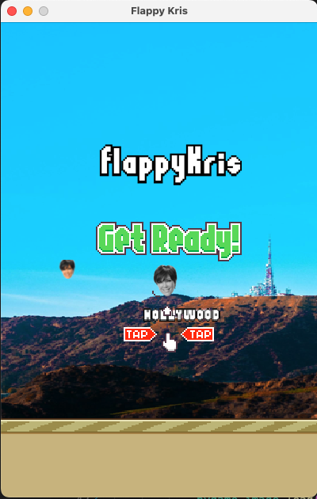

# Flappy Kris
Flappy Kris is a flappy bird style game written in python. Done as a small project for my 11 year old sister Amanda to have a laugh. Just for fun!

Requirements: pygame

## Current Looks

## TO DO
[X] Include better sounds
[ ] Better quality Kris Jenner

Heavily inspired by: https://www.geeksforgeeks.org/how-to-make-flappy-bird-game-in-pygame/ and https://www.askpython.com/python/examples/flappy-bird-game-in-python 
